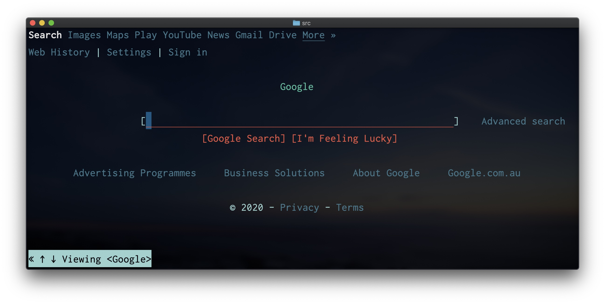

# Browser

## Browsh

Uses a headless Firefox to support javascript, image and even videos.

---

Details

| Key Info    |                                                                         |
| :---------- | ----------------------------------------------------------------------- |
| Install     | 💻 `brew tap browsh-org/homebrew-browsh` and then `brew install browsh` |
| Usage       | 💲 `browsh`                                                             |
| Config File | ⚙️ `~/.config/browsh`                                                   |
| Link        | 🌏 github.com/zdharma/fast-syntax-highlighting                          |

---

## W3m

Text based browser with image support.

---

Details

| Key Info    |                        |
| :---------- | ---------------------- |
| Install     | 💻 `brew install w3m`  |
| Usage       | 💲 `w3m`               |
| Config File | ⚙️ `~/.w3m/`           |
| Link        | 🌏 w3m.sourceforge.net |

---
