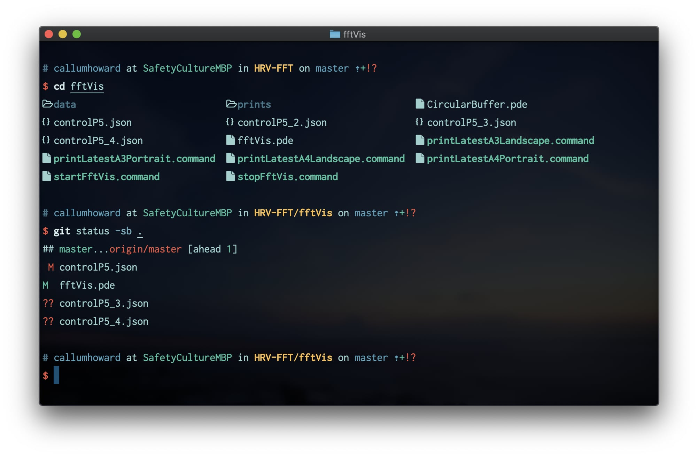
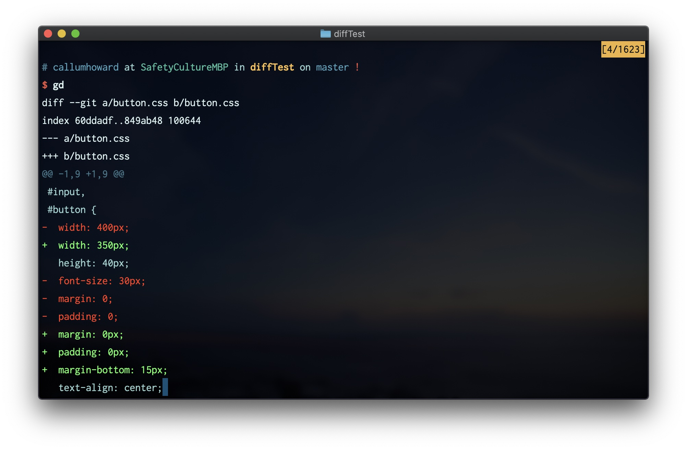

# Git

---

<Details>
<Summary>Details</Summary>

| Key Info    |                                           |
| :---------- | ----------------------------------------- |
| Install     | [🍺](https://brew.sh/) `brew install git` |
| Usage       | 💲 `git`                                  |
| Config File | ⚙️ `~/.gitconfig`                         |
| Link        | 🌏 git-scm.com                            |

</Details>

---

## Customisation

### Pretty status

---

<Details>
<Summary>Details</Summary>

The `git status` command shows the current state of the repository you are in. I think it is an important command to use often, to check you are committing the right files, or quickly see where your unstaged changes are.


This command is quite verbose with hints that I don't need to see each time. To see a short version we can use:

```sh
git status -s -b
```

- `-s` for short
- `-b` for showing the branch status on the first line

The flags can be combined like so:

```sh
git status -sb
```

Sometimes it is useful to view only the status of the files in the current directory and below. Like many other Git commands, this can be done by appending a path to the command:

```sh
git status -sb .  # . is the current directory
```



- The first line shows branch information and how many commits have been made since the last push.
- The left column has the abbreviated status for the file
  - `M` shows a file is modified,
  - `A` shows a file is added (for the first time)
  - `UU` shows a file has merge conflicts
  - `??` shows a file is untracked
  - Red means the file is unstaged
  - Green means the file is staged

#### Git Alias

A Git alias is an alias for a Git sub-command that starts with the `git` prefix. These are stored in `~/.gitconfig`.

We can add a Git alias for our short status command with:

```sh
git config --global alias.sb "status -sb"
```

Now we can use `git sb` to run the same command.

#### Shell Alias

We can optionally make this even shorter by putting a shell alias in `~/.bashrc` for Bash, or `~/.zshrc` for Zsh.

> You can find which shell you are currently runnin with `echo $SHELL`

To add a shell alias for the `git status -sb` command, use:

```sh
alias s="git status -sb"
```

After restarting your shell or reloading your shell config with `source ~/.zshrc`, you can now run the command with `s`. Nice and short!

#### With diff-stat


We can take the above even further. The `git diff --stat` command shows relative change statistics for each file. With a [small shell script](https://github.com/CallumHoward/dotfiles/blob/master/scripts/git-st) we can combine this with the aliased Git status command.

Copy this script [here](https://github.com/CallumHoward/dotfiles/blob/master/scripts/git-st) and put it somewhere in your `$PATH`. I place it in `~/.local/bin/`, and you can use this code to do the same:

```sh
mkdir -p ~/.local/bin  # Make a folder for scripts
curl https://raw.githubusercontent.com/CallumHoward/dotfiles/master/scripts/git-st -o ~/.local/bin/git-st
chmod +x ~/.local/bin/git-st  # Add execute permissions to the downloaded script
export PATH=$PATH:~/.local/bin  # Add the script folder to your $PATH
```

To make sure this directory is always in your path, add this export command to your `~/.bashrc` or `~/.zshrc`.

```sh
export PATH=$PATH:~/.local/bin
```

Now we should be able to run `git-st` and we will get the combined `git status -sb` and `git diff --stat` output. The last thing to do is update our alias in our `~/.bashrc` or `~/.zshrc`.

```sh
alias s="git-st"
```

Remember to restart your shell or `source ~/.bashrc`.

##### Alternate method

If that doesn't work you can alias directly to the location where you downloaded the script, just remember to `chmod +x ~/.local/bin/git-st` as well:

```sh
alias s="~/.local/bin/git-st"
```

Now there is only one problem I found, if there are many changes to one file, the `git diff --stat` output might wrap around, which looks kind of ugly. Instead we can truncate the output if it exceeds the column width (in characters) of the terminal. This only works for when the command is run however. If the terminal is resized after then there is no way to redraw a command that has already finished.

```sh
git-st | perl -pe "s/^((?:(?>(?:\e\[.*?m)*).){$COLUMNS}).*/\$1\e[m/"
```

#### With fallback to `ls`


`s` is my most used command, so for me it has become muscle memory. Sometimes I use it compulsively by mistake when I'm not in a Git repository. In this case, `git-st` will just give a message like `fatal: not a git repository (or any of the parent directories): .git`. Instead I thought it would be more useful to silently fall back to `ls` in this case. This can be achieved with the following:

```sh
if command -v git-st > /dev/null 2>&1; then
    alias s='(set -o pipefail && git-st 2>/dev/null | perl -pe "s/^((?:(?>(?:\e\[.*?m)*).){$COLUMNS}).*/\$1\e[m/") || ls'
    alias s.='(set -o pipefail && git-st . 2>/dev/null | perl -pe "s/^((?:(?>(?:\e\[.*?m)*).){$COLUMNS}).*/\$1\e[m/") || ls'
else
    alias s="git sb 2>/dev/null || ls"
fi
```

The caveat here is that we can no longer provide a filepath argument to the s command, so I aliased `s.` to find only the status of the files in the current directory and below. We could get around this limitation with a shell function, an exercise that I will leave to the reader.

</Details>

---


### Pretty log

---

<Details>
<Summary>Details</Summary>

If you run `git log` you can see the history of commits in a Git repo in your [Pager](https://en.wikipedia.org/wiki/Terminal_pager) (probably `less`).


Run this command to add the `git lg` alias to your `~/.gitconfig` file:

```sh
git config --global alias.lg "log --color --graph --pretty=format:'%Cred%h%Creset -%C(yellow)%d%Creset %s %Cgreen(%cr) %C(bold blue)<%an>%Creset' --abbrev-commit"
```

Now you have the command `git lg` to display a pretty formatted and coloured Git log:


- Where branches diverge and merge is represented on the left
- The shot commit hash can be used anywhere the long hash can be used
  - eg. `git checkout 481d7b0`
- The commit where the tips of branches, tags and remotes are shown in yellow
- `git log` will still work the same as before to see full details
- You can remove the alias by deleting the relevant line in `~/.gitconfig`

This can optionally be made shorter with some shell aliases (put in `~/.bashrc` or `~/.zshrc`):

```sh
alias lg="git lg"
alias lgs="git lg --stat"   # Show pretty log with statistics on which files changed
alias lgp="git lg -p"       # Show pretty log with patch diff
alias lgh="git lg -n10"     # Show only 10 commits
```


#### Links

Source: [Coder Wall](https://coderwall.com/p/euwpig/a-better-git-log)

</Details>

---


### Pretty stash list

---

<Details>
<Summary>Details</Summary>

You can stash unstaged changes in a Git repository with `git stash`, and restore those changes with `git pop`. Here are a few other useful stash related commands:

```sh
git stash push -m "descriptive comment here"  # Add a message to remind you what's in this stash
git stash apply  # Apply the stash (most recent by default) without "popping" it from the list
git stash list   # Show the list (stack) of stashes, most recent at the top
```

Similair to above with Git log, you can add an alias for listing stashes (`git stash list`) with pretty formatting and colours. Run this command to add it to your `~/.gitconfig`:

```sh
git config --global alias.sl "stash list --pretty=format:'%C(red)%h%C(reset) - %C(yellow)(%gd%C(yellow))%C(reset) %<(70,trunc)%s %C(green)(%cr) %C(bold blue)<%an>%C(reset)'"
```

Again, a shell alias can optionally also be added:

```sh
alias sl="git sl"
```


- The reference for each stash shown in yellow can be used in git commands
  - eg. `git show stash@{2}`, `git diff stash@{0} stash@{1}`, `git apply stash@{3}`

Source: [StackOverflow](https://stackoverflow.com/a/38826108/13159693)

</Details>

---


### Pretty reflog

---

<Details>
<Summary>Details</Summary>

> _Reference logs, or "reflogs", record when the tips of branches and other references were updated in the local repository._
> -- [Git documentation](https://git-scm.com/docs/git-reflog)

This command is not used as often, but for the sake of completeness it can also be made pretty with similair styling. The unaliased command is `git reflog`. Add an alias to your `~/.gitconfig` with:

```sh
git config --global alias.rl "reflog --pretty=format:'%Cred%h%Creset %C(yellow)%gd%C(reset) %C(auto)%gs%C(reset) %C(green)(%cr)%C(reset) %C(bold blue)<%an>%Creset' --abbrev-commit"
```

And an optional shell alias:

```sh
alias rl="git rl"
```


#### Links

Source: [StackOverflow](https://stackoverflow.com/a/38826108/13159693)

</Details>

---


### Other Git aliases

Here are some git aliases that I find useful.

#### Shell Aliases

> Note that aliases are only useful if you remember them, and it is hard to memorise all of these. Consider taking a couple that you think will be most useful and come back for more when you have those memorised. It can also sometimes be useful to memorise the underlying command if you find yourself working on a machine without your config setup.

---

<Details>
<Summary>Details</Summary>

```sh
alias g="git"
alias gca="git commit --amend"  # In case you forgot to add something to your last commit
alias gcv="git commit -v"  # Write commit message in Vim
alias grv="git remote -v"  # List remotes
alias cob="git checkout -b"  # Check out a new branch like: `cob my-feature`
alias cdg='cd "`git rev-parse --show-toplevel 2>/dev/null | head -1`"'  # cd into git root
alias gd="git diff"
alias gd.="git diff ."
alias gdc="git diff --cached"
alias gdc.="git diff --cached ."
alias gdd="git difftool"  # git diff using the difftool configured in ~/.gitconfig
alias pu="git push -u"  # push and set upstream branch (useful for pushing a local branch for the first time)
alias pull="git pull"
alias show="git show"

# List most recently used branches
alias ba="git for-each-ref --count=30 --sort=-committerdate refs/heads/ --format='%(refname:short)'"
alias baa="git branch -a"  # list all branches including non-local branches on remotes
# Choose a branch to checkout. Requires FZF, diff-so-fancy and xargs
alias cof="ba | grep -v master | fzf --preview='{ git diff --color=always --stat master...{}; git diff --color=always master...{}; } | diff-so-fancy' | xargs git checkout"

# With the following aliases, it is possible to keep a feature branch up to date with master by doing
# `stash && com && pull && co - && gmm && pop`
alias stash="git stash"
alias com="git checkout master"
alias pull="git pull"
alias gmm="git merge master"
alias pop="git stash pop -q && s"
```

Note we can check out the last used branch with:

```sh
git checkout -
```

</Details>

---

#### Zsh Functions

For Zsh I also have some shell functions for Git operations. I have made these functions mainly so I can trigger the Git status `s` alias after each operation. It will only do a git status if it would fit on the screen. They could probably be adapted to Bash without too much modification.

---

<Details>
<Summary>Details</Summary>

```sh

# Add files with: `a <path1> <path2> <path3>...`
function git_add() {
    if [ "$#" -eq 0 ]; then
        git add -v .
    else
        git add -v "$@"
    fi

    if (( `git status -s | wc -l` < $LINES )); then
        s | tail -n +2
    fi
}
alias a="git_add"

# Commit staged files with a message: `cm This is the commit message, quotes not needed`
function cm() {
    nocorrect git commit -m "$*"
    if (( `git status -s | wc -l` < $LINES )); then
        s | tail -n +2
    fi
}

function git_reset() {
    git reset -q "$@"
    if (( `git status -s | wc -l` < $LINES )); then
        s | tail -n +2
    fi
}
alias grs="git_reset"

function git_checkout() {
    git checkout "$@"
    if (( `git status -sb | wc -l` < $LINES )); then
        s
    fi
}
alias co="git_checkout"

# Browse to the current branch in GitHub
function br() {
    if command -v xdg-open > /dev/null 2>&1; then
        bin="xdg-open"
    elif command -v open > /dev/null 2>&1; then
        bin="open"
    fi

    local gitpath=`git rev-parse --show-prefix 2>/dev/null | head -1`
    if [[ gitpath == '' ]]; then return; fi

    local remote="origin"
    if [ "$#" -ne 0 ]; then
        remote="$1"
    fi

    local url=`git remote get-url $remote | head -1`
    if [[ "$url" =~ "@" ]]; then
        url="${url/':'//}"
        url="${url/*\@/https://}"
    fi

    url="${url/".git"}"

    local branch=`git rev-parse --abbrev-ref HEAD | head -1`
    $bin "$url/tree/$branch/$gitpath"
}

# Clone including submodules, using multithreading and then cd into the cloned repo
function clo() {
    git clone --recursive -j4 "$1" && cd *(/om[1])
}
```

</Details>

---

#### Zsh Aliases

Zsh supports some special aliases that can be useful for working with Git.

##### Zsh Suffix Aliases

---

<Details>
<Summary>Details</Summary>

Suffix aliases allow a command to be run if a file with a suffix is given. When cloning a Git repo, the URL usually ends with `.git`. Therefore we can tell Zsh when it sees a plain Git URL ending in `.git` with no command, use the `clo` function defined above.

```sh
alias -s git="clo"
```

</Details>

---

##### Zsh Global Aliases

---

<Details>
<Summary>Details</Summary>

With Zsh's global aliases, we can evaluate commands to insert into a commandline. The following command and FZF can be used to select a branch. It can be used like `co BF`, which will allow you to select a branch interactively with FZF.

```sh
alias -g BF='`git branch | fzf`'
```

If we also source this function in our `~/.zshrc`, we can expand global aliases with `<TAB>`.

```sh
# Automatically Expanding Global Aliases (tab key to expand)
# references: http://blog.patshead.com/2012/11/automatically-expaning-zsh-global-aliases---simplified.html
globalias() {
  if [[ $LBUFFER =~ '[A-Z0-9]+$' ]]; then
    zle _expand_alias
    zle expand-word
  fi
  zle expand-or-complete
}
zle -N globalias
bindkey "^I" globalias                 # tab key to expand globalalias
```

Here are some more global aliases for inserting files based on their Git status. They can be used:

```sh
alias -g GM='`sb . | tail -n +2 | egrep "^\s[MD]" | cut -c 4- | tr "\n" " "`'
alias -g GU='`sb . | tail -n +2 | egrep "^\s?U" | cut -c 4- | tr "\n" " "`'
alias -g GQ='`sb . | tail -n +2 | egrep "^\s?\?" | cut -c 4- | tr "\n" " "`'
```

</Details>

---

## Tools

In the previous sections we customised functionality built in to Git. Here we will look at how we can extend Git functionality in the shell using some other tools.

### Diff Tools

#### git diff

Basic diff command that comes with Git.

---

<Details>
<Summary>Details</Summary>

| Key Info    |                                           |
| :---------- | ----------------------------------------- |
| Install     | [🍺](https://brew.sh/) `brew install git` |
| Usage       | 💲 `git diff`                             |
| Config File | ⚙️ `~/.gitconfig`                         |
| Link        | 🌏 git-scm.com/docs/git-diff              |

Here are some useful aliases that can be used to display diffs for git:

```sh
alias gd="git diff"
alias gdc="git diff --cached"  # Show what has been staged
alias gdd="git difftool"  # You can set the difftool in ~/.gitconfig
alias gdmb="git diff master...HEAD"  # Show changes since branch diverged, same as GitHub PR compare
alias lgmb="lg master...HEAD"  # Show commits since branch diverged
```

Another useful flag to use is `--name-only`, which echos only the names of the files that have changes, for example:

```sh
gdmb --name-only
```

You could then pipe that into [FZF](https://github.com/junegunn/fzf) to filter the list and copy the result with something like:

```sh
gdmb --name-only | fzf -m | tr "\n" " " | pbcopy
vim -p <paste-selected-files-here>
```

This is still a bit to type, but it can be made easier with some Zsh [global aliases](https://blog.lftechnology.com/command-line-productivity-with-zsh-aliases-28b7cebfdff9).

```sh
alias -g NO='--name-only'
alias -g 2L='| tr "\n" " "'  # Convert lines to space-seperated list
alias -g 2R='| tr " " "\n"'  # Convert space-seperated list to lines
alias -g FZ='| fzf -m'  # FZF with multi-selection, then send to the clipboard
alias -g P='| pbcopy'
alais v="vim"
```

Then we can do:

```sh
gdmb NO FZ 2L P
v -p <paste>
```

Actually it is probably easier to use the FZF plugin in Vim, or make an alias for the whole thing.  
Vim could also be easily replaced in the above example with `code` to open the files in VSCode.

</Details>

---



#### diff-so-fancy

Simple, unified Git diff tool that looks good on 256-color terminals. Can show whitespace changes.

---

<Details>
<Summary>Details</Summary>

| Key Info    |                                                                                               |
| :---------- | --------------------------------------------------------------------------------------------- |
| Install     | [🍺](https://brew.sh/) `brew install diff-so-fancy`                                           |
| Usage       | 💲 Add command to `~/.gitconfig`, see [here](https://github.com/so-fancy/diff-so-fancy#usage) |
| Config File | ⚙️ `~/.gitconfig`                                                                             |
| Link        | 🌏 github.com/so-fancy/diff-so-fancy                                                          |

</Details>

---


#### delta

Advanced customisable diff tool with:

- Syntax highlighting
- Optional side-by-side layout
- Line numbers
- Smart diffing

Looks great on light themed terminals. Can be used for diffing non-git files.

---

<Details>
<Summary>Details</Summary>

| Key Info    |                                                                                                 |
| :---------- | ----------------------------------------------------------------------------------------------- |
| Install     | [🍺](https://brew.sh/) `brew install delta`                                                     |
| Usage       | 💲 Add command to `~/.gitconfig`, see [here](https://github.com/dandavison/delta#configuration) |
| Config File | ⚙️ `~/.gitconfig`                                                                               |
| Link        | 🌏 github.com/dandavison/delta                                                                  |

Delta uses [`bat`](https://github.com/sharkdp/bat) for syntax highlighting. Personally I think in a 256 color terminal it makes the diff harder to read, but with truecolor and a white background it looks quite nice. It also has a `--diff-so-fancy` emulation mode, and when combined with `--side-by-side` this looks quite nice and has the easiest to read diffing algorithm.  
To get this, make sure you have the following in your `~/.gitconfig`:

```conf
[pager]
    diff = delta --side-by-side --diff-so-fancy
```


</Details>

---


#### icdiff

Simple side-by-side general diff tool. Can be used for diffing non-git files.

---

<Details>
<Summary>Details</Summary>

| Key Info    |                                                                                                    |
| :---------- | -------------------------------------------------------------------------------------------------- |
| Install     | [🍺](https://brew.sh/) `brew install icdiff`                                                       |
| Usage       | 💲 Add command to `~/.gitconfig`, see [here](https://github.com/jeffkaufman/icdiff#using-with-git) |
| Config File | ⚙️ `~/.gitconfig`                                                                                  |
| Link        | 🌏 github.com/jeffkaufman/icdiff                                                                   |

</Details>

---


#### vimdiff

Powerful diff tool with code folding that can be used to edit files and can also diff non-git files.

---

<Details>
<Summary>Details</Summary>

| Key Info    |                                                                                                          |
| :---------- | -------------------------------------------------------------------------------------------------------- |
| Install     | [🍺](https://brew.sh/) `brew install vim`                                                                |
| Usage       | 💲 Add command to `~/.gitconfig`, see [here](https://michaelthessel.com/using-vimdiff-as-git-diff-tool/) |
| Config File | ⚙️ `~/.gitconfig` and `~/.vimrc` (or `~/config/nvim/init.vim` if using [NeoVim](https://neovim.io/))     |
| Link        | 🌏 devhints.io/vim-diff                                                                                  |

`vimdiff` is an alias for `vim -d` that is installed with Vim, there is a good chance it comes with your OS.

Set up using the [this](https://michaelthessel.com/using-vimdiff-as-git-diff-tool/) guide.
You can learn more about using Vim by running `vimtutor`, or check out a past CSESoc Vim Workshop [here](https://www.youtube.com/watch?v=jdsfraYakEc).

If you want to use NeoVim instead of Vim for diffing, add this to your `~/.gitconfig`:

```conf
[difftool "vimdiff"]
    cmd = nvim -d $BASE $LOCAL
```

Add the following to your shell config (`~/.bashrc` or `~/.zshrc`) to use Vim for general Git operations like writing commit messages and interactive rebase.

```sh
export EDITOR=vim
```

or

```sh
if command -v nvim > /dev/null 2>&1; then
    export EDITOR=nvim
else
    export EDITOR=vim
fi
```

...to use [NeoVim](https://neovim.io/) with a Vim fallback.

Further reading:

- [Vim universe. Vim as a diff tool - YouTube](https://youtu.be/zEah_HDpHzc)
- [Vimways - The Power of Diff](https://vimways.org/2018/the-power-of-diff/)

</Details>

---


#### jd

Diff JSON blobs recursively ignoring order of keys

---

<Details>
<Summary>Details</Summary>

| Key Info    |                                                                                                     |
| :---------- | --------------------------------------------------------------------------------------------------- |
| Install     | [🍺](https://brew.sh/) `brew install jd`                                                            |
| Usage       | 💲 `jd [OPTION]... FILE1 FILE2`, see [here](https://github.com/josephburnett/jd#command-line-usage) |
| Config File | ⚙️ -                                                                                                |
| Link        | 🌏 github.com/josephburnett/jd                                                                      |

Diffing JSON files can be interesting because sometimes you will be comparing two JSON blobs with only a few differences, but the ordering is different which can throw off the diffing algorithm and give a messy result:


`jd` will output a diff ignoring the ordering, showing only what was changed and where in the hierarchy it is. We can view the output with some syntax highlighting by piping it into Vim:

```sh
jd a.json b.json | vim +'set ft=diff | g/^@/norm O' -
```

- `vim -` reads input from stdin, so you can pipe commands into it. If using NeoVim you can omit the `-` and it will still work.
- `vim +'<command>'` runs a command in Vim once it is opened
  - `set ft=diff` sets the filetype used for syntax highlighting to be `diff` type.
  - `g/^@/norm O` is to add an extra line between diffs, making it easier to read. Also sets the search pattern to "@" so you can quickly jump between diff chunks with `n` and `N`.

</Details>

---


#### Links

- [Other alternative diff tools](https://github.com/dandavison/delta#similar-projects)
- [Greg Hurrell, Git pager enhancements - YouTube](https://youtu.be/Mv_oKbjRT_s)

## Git Grep

The `git grep` commmand comes with Git, and mostly works just like `grep` except it can be much faster, and only searches tracked files in a Git repo.

---

<Details>
<Summary>Details</Summary>

Unlike `grep`, you don't need to specify the `-r` recursive flag, and you don't need to specify a directory.

Here is an example of how different the performance can be (compare the total time).


You can use this alias to format the output so that it is similair to RipGrep:

```sh
alias gg="git grep -i -n --heading --break"
```

- `-i` to ignore case
- `-n` to show line numbers
- `--heading` to group matches by file
- `--break` to add an empty line between grouped file matches

</Details>

---


## Git Repo Updater

Update multiple repos at once.

---

<Details>
<Summary>Details</Summary>

Useful if you have a directory of repositories and you don't want to `cd` into each one individually and `pull` each branch.

| Key Info    |                                                                            |
| :---------- | -------------------------------------------------------------------------- |
| Install     | [🍺](https://brew.sh/) `brew install gitup`                                |
| Usage       | 💲 `gitup .`, see [here](https://github.com/earwig/git-repo-updater#usage) |
| Config File | ⚙️ -                                                                       |
| Link        | 🌏 github.com/earwig/git-repo-updater                                      |

</Details>

---


## GitHub

### hub

Unofficial CLI for GitHub.

---

<Details>
<Summary>Details</Summary>

| Key Info    |                                                                                                         |
| :---------- | ------------------------------------------------------------------------------------------------------- |
| Install     | [🍺](https://brew.sh/) `brew install hub`                                                               |
| Usage       | 💲 `hub` or `git` with passthrough, see [here](https://github.com/github/hub#usage)                     |
| Config File | ⚙️ `~/.gitconfig`and`~/bashrc`or`~/.zshrc`, see [here](https://hub.github.com/hub.1.html#configuration) |
| Link        | 🌏 hub.github.com                                                                                       |

</Details>

---


### GitHub CLI

Official beta CLI for GitHub.

---

<Details>
<Summary>Details</Summary>

| Key Info    |                                                               |
| :---------- | ------------------------------------------------------------- |
| Install     | [🍺](https://brew.sh/) `brew install github/gh/gh`            |
| Usage       | 💲 `gh pr list`, see [here](https://github.com/cli/cli#usage) |
| Config File | ⚙️ -                                                          |
| Link        | 🌏 cli.github.com                                             |

</Details>

---


