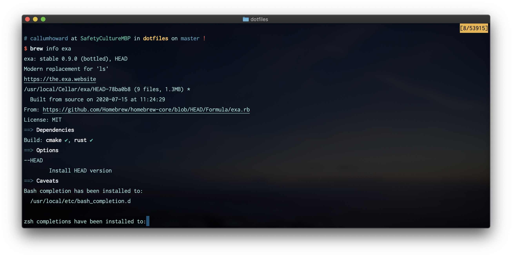

# Command Line Tools

## Package Manager

## Terminal Emulator

## Shell

## [Source Control](git/git.md)

## Terminal Multiplexer

## Remote Computing

## File Manager

## Search

## Text Editor

## REPL

## Debugger

## Browser
