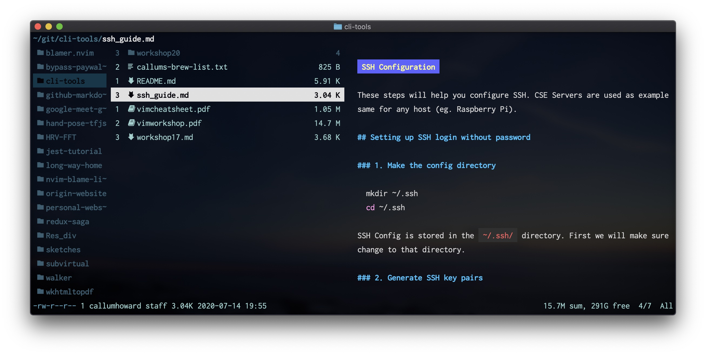
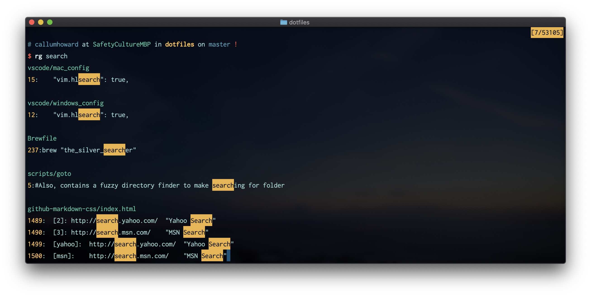
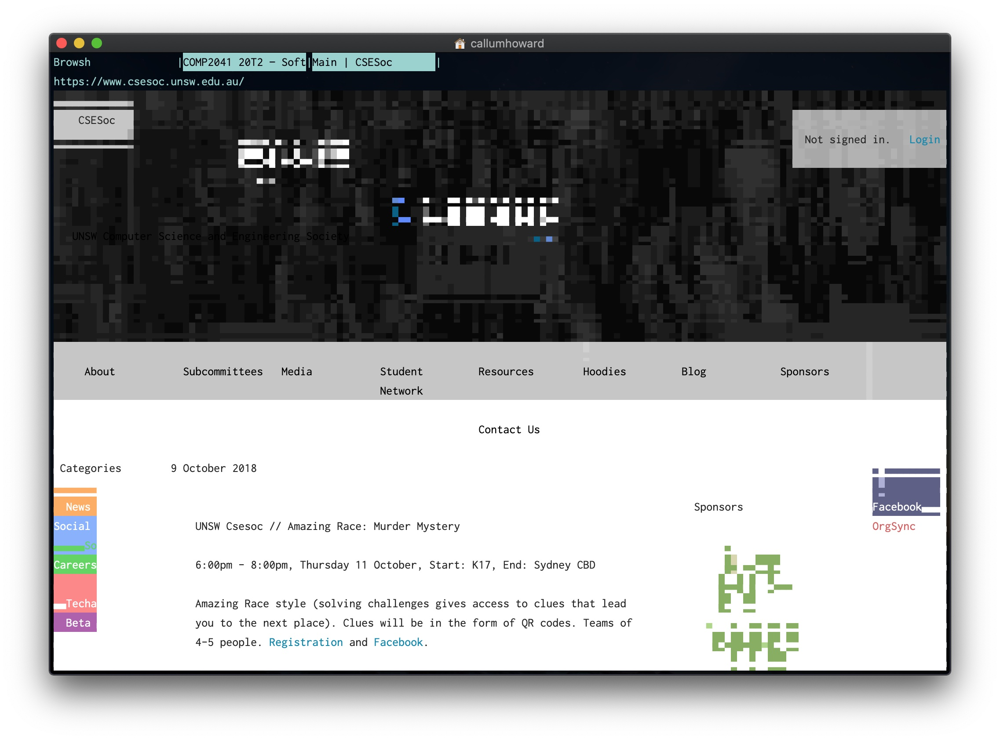

# Command Line Tools

## [Package Manager](package_manager/pagacke_manager.md)

## [Terminal Emulator](terminal_emulator/terminal_emulator.md)

## [Shell](shell/shell.md)

## [Source Control](git/git.md)

## [Terminal Multiplexer](terminal_multiplexer/terminal_multiplexer.md)

## [Remote Computing](https://github.com/CallumHoward/cli-tools/blob/master/ssh_guide.md)

## [File Browser](file_browser/file_browser.md)

## [Search](search/search.md)

## [Text Editor](text_editor/text_editor.md)

## [REPL](repl/repl.md)

## [Debugger](debugger/debugger.md)

## [Browser](browser/browser.md)

