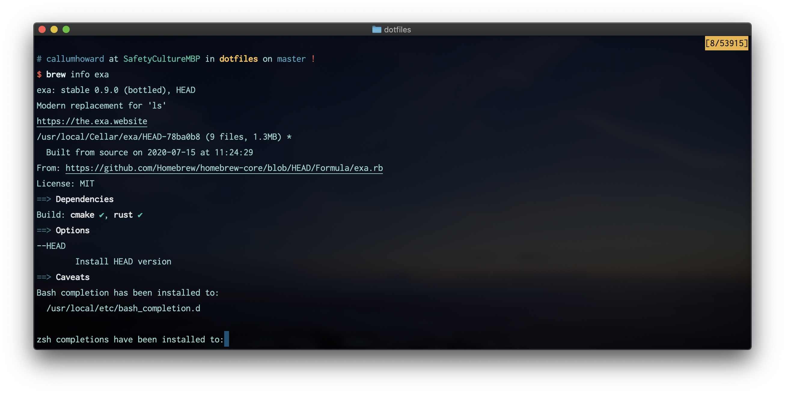

# Package Manager

A package manager is very useful for managing your command line tools. With one command it is possible to update all your packages, and the list of packages can be used to replicate the same setup on another machine.

## Homebrew

Homebrew is a package manager for macOS and Linux.

---

<Details>
<Summary>Details</Summary>

| Key Info    |                                                              |
| :---------- | ------------------------------------------------------------ |
| Install     | 🍺 Single command install [here](https://brew.sh)            |
| Usage       | 💲 `brew -h` or see the [docs](https://docs.brew.sh/Manpage) |
| Config File | ⚙️ `~/.zshrc` or `~/.bashrc`                                 |
| Link        | 🌏 brew.sh                                                   |

- Homebrew builds packages but handles all the configuration and build process using _formulas_, so you can just use `brew install <package>`.
- The advantage of this is your packages are all sandboxed, installed seperately from your system packages so you can install and remove packages without any concerns that it might effect system tools.
- This also means that `sudo` or admin privelages are not necessary to install packages.
- The downside is some packages take a long time and a lot of processing power to build (eg. `llvm` and `gcc`)

### Useful commands

```sh
brew install <package>
brew info <package>  # Sometimes has extra information about package
brew uninstall <package>
brew cask install <package>  # Used to install non-commandline applications eg. firefox
brew list     # List installed packages
brew update   # Update formula listings
brew upgrade  # Upgrade packages if available
brew cleanup  # Clean up cached files
brew doctor   # Find any problems or incomplete installations
```

### Useful alias

```sh
# Update, upgrade, cleanup and then sound the terminal bell
alias bu="brew update && brew upgrade && brew cleanup; tput bel"
```

</Details>

---



## Chocolatey

Package manager for Windows Powershell or CMD. Consider using WSL Bash for Windows!

---

<Details>
<Summary>Details</Summary>

| Key Info    |                                                                         |
| :---------- | ----------------------------------------------------------------------- |
| Install     | 🍫 Install with the instructions [here](https://chocolatey.org/install) |
| Usage       | 💲 See the [docs](https://chocolatey.org/docs/commands-install#usage)   |
| Config File | ⚙️ See the [docs](https://chocolatey.org/docs/commands-config)          |
| Link        | 🌏 chocolatey.org                                                       |

</Details>

---
