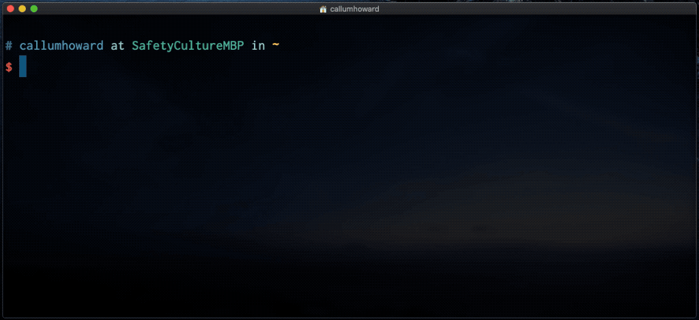
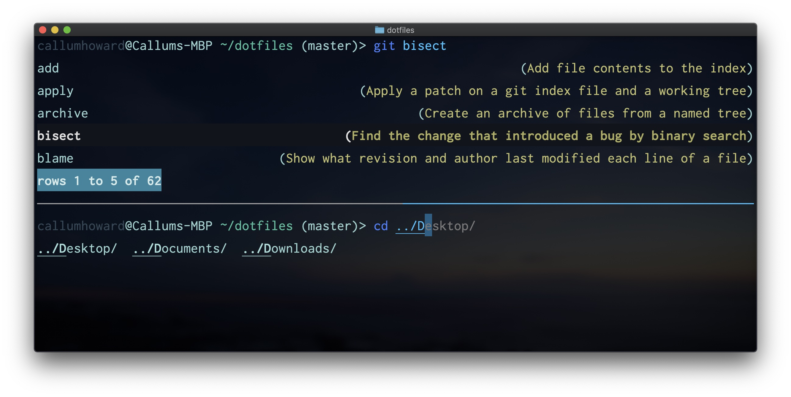

# Shell

## Bash

Most prominent unix shell, default on most Linux Distros.

| Key Info    |                                                                                                  |
| :---------- | ------------------------------------------------------------------------------------------------ |
| Install     | [🍺](https://brew.sh/) Comes with Linux, but can install latest version with `brew install bash` |
| Usage       | 💲 `bash`                                                                                        |
| Config File | ⚙️ `~/.bashrc`                                                                                   |
| Link        | 🌏 www.gnu.org/software/bash                                                                     |

### Bash features

#### Config File

The `~/.bashrc` file contains Bash commands. It gets sourced when the shell starts. After changing it you can either restart your shell, or source ~/.bashrc` to get changes in your existing shell.

#### Keyboard Shortcuts

##### Readline keybindings

Readline keybindings work by default in any shell and many command line interfaces eg. [REPLs](../repl/repl.md). They are quite similair to Emacs keybindings.

See the [Readline Cheat Sheet](http://readline.kablamo.org/emacs.html).

##### Vi keybindings

Shells also have built-in Vi keybindings, very similair to Vim. To set the shell to use these bindings, add this to your `~/.bashrc`.

```sh
set -o vi
```

By default, Esc will put you into Vi Normal mode. Use `i` to enter back into Insert Mode.

[Vi-mode Keybindings Cheat Sheet](https://catonmat.net/ftp/bash-vi-editing-mode-cheat-sheet.pdf)

To extend this further, see [Zsh Vi Keybindings](#vi-keybindings-2)

##### Other

##### Alias a command

You can make shortcuts for commands that you use often to reduce the amount of typing needed. You can enter an alias command at the commandline prompt, but it will only last until you close the terminal session. To have the alias available in every terminal, place it in your `~/.bashrc` file.

```sh
alias m="make"
```

##### Use previous parameter

The `Meta` key, otherwise known as `Alt` or `Option` has some useful keybindings for reusing previous command parameters.

```sh
Meta-.
```

...where this means holding `Meta` and pressing `.`.

This can be quite useful to save typing long filepaths twice for example:

```sh
git diff wkhtmltopdf/qt/src/tools/idc/main.cpp
...
git add <Meta-.>  # expands to filepath above
```

If this doesn't work, check the settings on your terminal emulator on how to enable the Meta key.

#### Job Control

When running a command, you can use `Ctrl-Z` to _suspend_ it. You can check suspended jobs with the `jobs` command, and resume with `fg` (for **f**ore**g**round).

### Useful Aliases

### Further Reading

- [Bash scripting cheatsheet](https://devhints.io/bash)
- [Pure Bash Bible - Advanced scripting cookbook](https://github.com/dylanaraps/pure-bash-bible)
- [Callum's dotfiles](https://github.com/CallumHoward/dotfiles)
- [Efficient command-line navigation](https://cupfullofcode.com/blog/2013/07/03/efficient-command-line-navigation/index.html)

## Zsh

Mostly backwards compatible with Bash syntax. Now the default shell on macOS.

### Using Zsh

You can determine which shell you are running with `echo $SHELL`. If you are not already running Zsh and you have it installed, you can run `zsh` to start it.

### Setting Zsh as default shell

Instead of running `zsh` each time, we can change Zsh to be the default shell.

#### With Sudo (preferred)

```sh
chsh -s `which zsh`
```

If this doesn't work, you may need to add Zsh to the list of shells.

1. First find out where Zsh is installed with `whereis zsh`.
2. Choose the one you want, and copy the full path.
3. Do `sudo vim /etc/shells`, or use your preferred text editor
4. Paste the path at the end of the file.
5. Save and quit.
6. You may have to log out and log back in, (or restarting your computer will work too).
7. Then try the `chsh` command again.

#### Without Sudo

Sometimes you are on a machine with no `sudo`. In this case, the hackey way is to start Zsh from inside your `~/.bashrc`.

Add the following to your `~/.bashrc`:

```sh
# Only start Zsh if it is an interactive shell
[ -z "$PS1" ] && zsh
```

You can optionally replace `zsh` with the full path to the Zsh binary.

### Zsh Features

#### Keyboard Shortcuts

##### Vi Keybindings

Like with Bash, we can enable Vi-mode keybindings in Zsh with:

```zsh
bindkey -v
```

Zsh gives a lot of flexibility to make this Vi-mode more effective and user friendly.

It is possible to bind a different key sequence to enter Normal mode, eg. `kj`:

```sh
bindkey -M viins 'kj' vi-cmd-mode
```

We can also unbind `Esc` to enter Vi Normal Mode, so that we --or someone else, doesn't accidentally trigger it when we are trying to use `Esc`.

```sh
bindkey -rM viins '^['
```

### Zsh4Humans

Out-of-the-box configuration for Zsh.

---

<Details>
<Summary>Details</Summary>

| Key Info    |                                                                          |
| :---------- | ------------------------------------------------------------------------ |
| Install     | 💻 See [here](https://github.com/romkatv/zsh4humans#installation)        |
| Usage       | 💲 See [here](https://github.com/romkatv/zsh4humans#usage)               |
| Config File | ⚙️ See [here](https://github.com/romkatv/zsh4humans#configuration-files) |
| Link        | 🌏 github.com/romkatv/zsh4humans                                         |

Includes

- Prompt: Powerlevel10k
- Selector: FZF, fzf-tab
- Zsh Plugins: zsh-autosuggestions, zsh-completions, zsh-syntax-highlighting
- Send dotfiles over SSH

</Details>

---

### Oh-My-Zsh

Zsh configuration, framework and plugin-manager all in one.


---

<Details>
<Summary>Details</Summary>

| Key Info    |                                                                                                                                  |
| :---------- | -------------------------------------------------------------------------------------------------------------------------------- |
| Install     | 💻 Single command install [here](https://ohmyz.sh/#install), more [here](https://github.com/ohmyzsh/ohmyzsh/wiki/Installing-ZSH) |
| Usage       | 💲 See [here](https://github.com/ohmyzsh/ohmyzsh#using-oh-my-zsh)                                                                |
| Config File | ⚙️ ``~/.oh-my-zsh/`                                                                                                              |
| Link        | 🌏 ohmyz.sh                                                                                                                      |

</Details>

---

### Prompt

#### Powerlevel10k

Fast, feature packed, and easy to configure prompt framework.


---

<Details>
<Summary>Details</Summary>

| Key Info    |                                                                                      |
| :---------- | ------------------------------------------------------------------------------------ |
| Install     | 💻 See [here](https://github.com/romkatv/powerlevel10k#get-started)                  |
| Usage       | 💲 `gh pr list`, see [here](https://github.com/cli/cli#usage)                        |
| Config File | ⚙️ `~/.p10k.zsh`, see [here](https://github.com/romkatv/powerlevel10k#configuration) |
| Link        | 🌏 github.com/romkatv/powerlevel10k                                                  |

Features:

- Configuration Wizard
- Instant prompt caching (fast shell startup)
- Async Git processing
- Context sensitive decorations
- Transient prompt (decorations only on active prompt)
- Responsive with directory abbreviation
- Highly customisable

##### Alternatives

- [Spaceship](https://denysdovhan.com/spaceship-prompt/)
  
- [Pure](https://github.com/sindresorhus/pure)
  
- [Purs](https://github.com/xcambar/purs)  
  
- [Geometry](https://github.com/geometry-zsh/geometry)
  
- [agkozak](https://github.com/agkozak/agkozak-zsh-prompt)
  

...and many more themes listed [here](https://github.com/unixorn/awesome-zsh-plugins#themes) and [here](https://github.com/ohmyzsh/ohmyzsh/wiki/External-themes).

</Details>

---

### Plugin manager

Oh-my-zsh can work as a basic plugin manager, however the following examples provide better features. They can also work alongside Oh-my-zsh.

#### Zplug

Featureful plugin manager.


---

<Details>
<Summary>Details</Summary>

| Key Info    |                                                                                      |
| :---------- | ------------------------------------------------------------------------------------ |
| Install     | 💻 See [here](https://github.com/romkatv/powerlevel10k#get-started)                  |
| Usage       | 💲 `gh pr list`, see [here](https://github.com/cli/cli#usage)                        |
| Config File | ⚙️ `~/.p10k.zsh`, see [here](https://github.com/romkatv/powerlevel10k#configuration) |
| Link        | 🌏 github.com/romkatv/powerlevel10k                                                  |

Features

- Parallel update
- Lazy-loading support
- Startup cache

</Details>

---

#### Zinit

Powerful and performant plugin manager, but has a steeper learning curve.


---

<Details>
<Summary>Details</Summary>

| Key Info    |                                                              |
| :---------- | ------------------------------------------------------------ |
| Install     | 💻 See [here](https://github.com/zdharma/zinit#installation) |
| Usage       | 💲 See [here](https://github.com/zdharma/zinit#usage)        |
| Config File | ⚙️ `~/.zshrc`                                                |
| Link        | 🌏 zdharma.org/zinit/wiki                                    |

</Details>

---

### Plugins

#### Zsh-Syntax-highlighting

Syntax highlighting of shell command line, inspired by Fish shell.

---

<Details>
<Summary>Details</Summary>

| Key Info    |                                                                                            |
| :---------- | ------------------------------------------------------------------------------------------ |
| Install     | 💻 See [here](https://github.com/zsh-users/zsh-syntax-highlighting/blob/master/INSTALL.md) |
| Usage       | 💲 -                                                                                       |
| Config File | ⚙️ `~/.zshrc`                                                                              |
| Link        | 🌏 github.com/zsh-users/zsh-syntax-highlighting                                            |

</Details>

---

#### Fast-Syntax-Highlighting

An alternative to the above plugin, with more advanced syntax highlighting and colorscheme choices.


---

<Details>
<Summary>Details</Summary>

| Key Info    |                                                                                 |
| :---------- | ------------------------------------------------------------------------------- |
| Install     | 💻 See [here](https://github.com/zdharma/fast-syntax-highlighting#installation) |
| Usage       | 💲 -                                                                            |
| Config File | ⚙️ `~/.zshrc`                                                                   |
| Link        | 🌏 github.com/zdharma/fast-syntax-highlighting                                  |

</Details>

---

#### Zsh-Autosuggestions

Suggest command completions as you type.


---

<Details>
<Summary>Details</Summary>

| Key Info    |                                                                                        |
| :---------- | -------------------------------------------------------------------------------------- |
| Install     | 💻 See [here](https://github.com/zsh-users/zsh-autosuggestions/blob/master/INSTALL.md) |
| Usage       | 💲 -                                                                                   |
| Config File | ⚙️ See [here](https://github.com/zsh-users/zsh-autosuggestions#configuration)          |
| Link        | 🌏 github.com/zsh-users/zsh-autosuggestions                                            |

</Details>

---

#### Zsh-Autocomplete

Somewhat experimental autocomplete plugin for shell (no need to trigger completions with `TAB`).

[](https://asciinema.org/a/ZKC8EXNp1Xw1z8wjs9kVqRoJN)

---

<Details>
<Summary>Details</Summary>

| Key Info    |                                                                                            |
| :---------- | ------------------------------------------------------------------------------------------ |
| Install     | 💻 See [here](https://github.com/marlonrichert/zsh-autocomplete#installation)              |
| Usage       | 💲 -                                                                                       |
| Config File | ⚙️ `~/.zshrc`, see [here](https://github.com/marlonrichert/zsh-autocomplete#configuration) |
| Link        | 🌏 github.com/marlonrichert/zsh-autocomplete                                               |

</Details>

---

#### FASD

Maintains a list of files and directories ordered by most ussed, to allow jumping back to them whereever you are.



---

<Details>
<Summary>Details</Summary>

| Key Info    |                                                                                  |
| :---------- | -------------------------------------------------------------------------------- |
| Install     | 💻 See [here](https://github.com/clvv/fasd/wiki/Installing-via-Package-Managers) |
| Usage       | 💲 `,pattern<TAB>`, see [here](https://github.com/clvv/fasd#tab-completion)      |
| Config File | ⚙️ `~/.fasdrc`, see [here](https://github.com/clvv/fasd#tweaks)                  |
| Link        | 🌏 github.com/clvv/fasd                                                          |

</Details>

---

## Fish

Shell with nice features and UI out of the box, but does not aim to be Bash-compatible.



---

<Details>
<Summary>Details</Summary>

| Key Info    |                                                                           |
| :---------- | ------------------------------------------------------------------------- |
| Install     | [🍺](https://brew.sh/) `brew install fish`                                |
| Usage       | 💲 `fish`, see docs [here](https://fishshell.com/docs/current/index.html) |
| Config File | ⚙️ `~/.config/fish/config.fish`                                           |
| Link        | 🌏 fishshell.com                                                          |

</Details>

---
