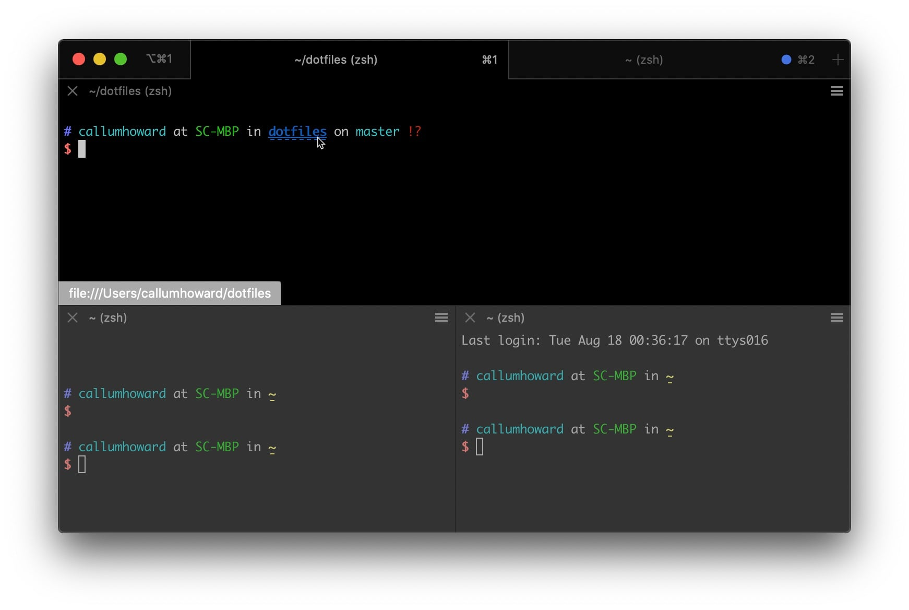

# Terminal Emulator

## General Tips and Features

### Font

The terminal primarily displays text, and if you want to spend lots of time using the terminal, then it is worth having a good monospaced font that is easy to read, looks good on the screen you are using, and helps you to distinguish similar looking characters like `oO0` and `ILi1|`.

You can't go wrong with any of [these fonts](https://www.nerdfonts.com/font-downloads). At the bottom of the page it details how to install using a package manager. Using the Homebrew package manager can make it easier to migrate your config for Mac and Linux machines.

To get the most out of the font, choose one with bold and italics styles and make sure your terminal is configured to use bold fonts rather than bright colors for emphasis.

#### Font icons

Optionally you can choose a font patched with icons for use in the terminal.

#### Ligatures

Ligatures allow common programming symbols made up of multiple characters to appear as a single symbol.

### TTY Features

These are features of your terminal emulator and how it interprets escape codes sent to it by the TTY. Many of these are also dependent on your _terminfo entry_, which can be seen with `echo $TERM`. This will be different if you are using a shell inside a [terminal multiplexer](terminal_multiplexer/terminal_multiplexer.md) (like Tmux or Screen) as the esapce codes used need to be adjusted. Your terminfo might be something like `xterm-256color` or `screen-256color`.

#### Color support

Over time terminal emulators have come to support more and more colors.

- 16 colors (customizable)
- 256 colors
- 24-bit "true color" (888 colors)

256 colors is the most ubiquitous, however many terminals now support true color. More info [here](https://gist.github.com/XVilka/8346728#terminal-colors).

The first 16 colors of the 256 color system are most often customizable. The terminal can be themed using variations on the 16 colors like:

- [Base16](http://chriskempson.com/projects/base16/)

  

Or completely different colors can be set from 8-16 such as in these themes:

- [Iceberg](https://github.com/cocopon/iceberg.vim/#terminal-emulators)

  

- [Gotham](https://github.com/whatyouhide/gotham-contrib)

  

#### Italics

Italics often needs to be enabled. Here is a [guide](https://hobo.house/2017/07/17/using-italics-with-vim-in-your-terminal/) on how to enable it.

#### UTF8 and Emoji Support

Terminal emulators have varying support for wide unicode and emoji. In some cases they are rendered using the width of two characters. See your terminal emulator of choice to find out more.

Further reading:
[Vim screencast #83: Emoji](https://www.youtube.com/watch?v=F91VWOelFNE)

#### Meta key

The meta key is the `alt` or `option` key, and it is desirable to have your terminal emulator interpret it as the meta key rather than OS specific functionality so that you can make use of shortcuts with the meta key modifier.

#### Mouse reporting

Even if you are aiming to use the keyboard as much as possible, the mouse can still be useful for scrolling or resizing panes in Tmux and splits in Vim.

#### Image support

Some terminals support the display of images embedded inline in the terminal with tools like [w3m](https://github.com/CallumHoward/cli-tools/blob/master/workshop20/file_browser/file_browser.md#w3m) and [Sixel](https://saitoha.github.io/libsixel/). This can be used to give image previews in [Ranger](https://github.com/CallumHoward/cli-tools/blob/master/workshop20/file_browser/file_browser.md#ranger) or other terminal file browsers, or display images in terminal [web browsers](https://github.com/CallumHoward/cli-tools/blob/master/workshop20/browser/browser.md) (ie. [w3m](https://github.com/CallumHoward/cli-tools/blob/master/workshop20/browser/browser.md)).

### Drag and drop files

Hot tip, if you drag and drop a file from the filesystem into the terminal, it will type out the path with spaces escaped.

If you are in MacOS, you can click and hold on the window icon to drag it, an easy way to change into that directory.

### Hyperlinks

Some terminals will use regex to match strings that look like links and allow you to click them to open in a browser. For example in the VSCode Terminal Emulator you can Cmd/Ctrl-click to open a link in the browser.

Some terminals like iTerm2 support attaching URLs to label text so the URL text doesn't have to be visible.

## Universal Terminal Emulators

### [Kitty](https://sw.kovidgoyal.net/kitty/)

Fast and featureful terminal emulator with GPU acceleration with window splits and tabs.

### [Alacritty](https://github.com/alacritty/alacritty)

- GPU accelerated
- Written in Rust
- Good performance

### [Hyper](https://hyper.is/)

- Electron JavaScript based terminal emulator

### [VSCode Terminal](https://code.visualstudio.com/docs/editor/integrated-terminal)

- Bundles [xterm.js](https://github.com/xtermjs/xterm.js) (same as Hyper)
- Integrates well with editor

### [Cool Retro Term](https://github.com/Swordfish90/cool-retro-term)

- Fun retro CRT post processing graphics effects

## Linux Terminal Emulators

### [Gnome-terminal](https://help.gnome.org/users/gnome-terminal/stable/)

### [xterm](https://invisible-island.net/xterm/)

### urxvt

- Unicode version of [rxvt](http://rxvt.sourceforge.net/), a lightweight replacement for xterm.

## macOS Terminal Emulators

### Terminal.app

- Comes installed on macOS
- Non-standard 256 colors tweaked by Apple designers

#### [Proxy Title Icon](https://github.com/CallumHoward/zsh-proxy-title)

Plugin for Zsh to update the macOS Terminal window icon and URL path with the current file/directory.

### [iTerm2](https://www.iterm2.com/)

Popular alternative to macOS Terminal.

- Tmux integration
- Hyperlink escape codes

### [Upterm](https://github.com/railsware/upterm)

(Deprecated) Forward thinking terminal emulator built on Electron.

## Windows Terminal Emulators

### [(New) Windows Terminal](https://github.com/microsoft/terminal)

- Supports [WSL](<#windows-subsystem-for-linux-(wsl2)>), PowerShell and DOS.

### Git Bash

### Windows Subsystem for Linux (WSL2)

This allows Linux to run in Windows using Hyper-V virtualization. Cmder, the (New) Windows Terminal, VSCode and other terminal emulators can use WSL and WSL2.

### Cygwin

A Linux emulator for Windows. I recommend using WSL instead.

### Cmder

- A nicer terminal emulator that supports DOS, Powershell, Git Bash, WSL side-by-side
- Portable and easy setup
- Nice default configuration

