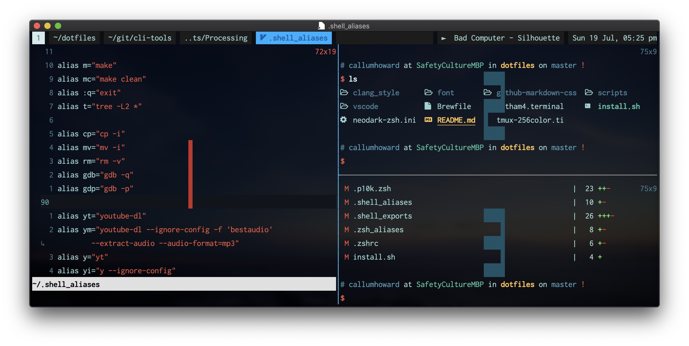

# Terminal Multiplexer

## Screen

Advantages over Tmux:

- Comes pre-installed on many distros
- Supports serial port communication

## Tmux

- Successor to Screen
- A more widely used Terminal Multiplexer



### Prefix

Tmux commands are entereed by first pressing a _prefix_ key, and then the Tmux specific shortcut. The default shotcut key is `Ctrl-b`, but a much easier prefix that many people use is `Ctrl-a` (which is the default prefix for Screen). This can be set by putting the following in `~/.tmux.conf`.

```sh
unbind C-b
set -g prefix C-a
bind C-a send-prefix
```

### Copy mode

Tmux manages terminal scrollback rather than your terminal emulator. This also means you want to enable mouse reporting in your terminal emulator if it is not set, and [enable the mouse](copy-paste-configuration) in Tmux config.
In copy mode you can scroll back the histoy of each _pane_ (split) of each _window_ (tab).

### Terminology

- Panes - Splits allowing multiple shells to be visible in one _window_
- Windows - Tabs that can contain multiple _panes_
- Session - A collection of _windows_ that will persist while the _session_ is active

### Cheat sheet

- [Cheat Sheet](https://cheatography.com/cloudranger/cheat-sheets/ultimate-tmux-v2-3/)

### [Tmux Plugin Manager](https://github.com/tmux-plugins/tpm)

Install and manage Tmux plugins!

#### [Tmux Sensible](https://github.com/tmux-plugins/tmux-sensible)

Some conservative sensible default configuration [options](https://github.com/tmux-plugins/tmux-sensible#options) that everyone would want.

#### [Tmux Open](https://github.com/tmux-plugins/tmux-open)

Open files and web links from Tmux's copy mode.

#### [Tmux Ressurect](https://github.com/tmux-plugins/tmux-resurrect)

Somewhat restore Tmux state, even after a system restart.

### Configuration Tips

Here are some hot tips for Tmux configuration that I find most useful. Tmux configuration goes in `~/.tmux.conf`. My configuration file can be found [here](https://github.com/CallumHoward/dotfiles/blame/master/.tmux.conf).

#### Set window titles

The setup that I have found to work best is the following, which works with the zsh-proxy-title plugin. This part of my config still has room for improvement. In the future I would like to add context specific icons to the window titles (currently I only have a Vim specific icon). I also want to add functionality to override the window title with a custom name and disable auto-naming for that window.

It requires Zsh running Oh-My-Zsh, and configuration in Tmux and Vim.

Oh-My-Zsh comes with [functionality](https://github.com/ohmyzsh/ohmyzsh/blob/95218372402afc9aeafc89c0984310387ce79599/lib/termsupport.zsh) to set the title each time the prompt is drawn.

Here is the configuration for Tmux:

```sh
set -g automatic-rename 1
set -g set-titles on
set -g set-titles-string '' # or use '#W'  # program name
```

And here is the configuration for Vim:

```vim
" set title for tmux
if exists('$TMUX')
    autocmd WinEnter,BufWinEnter,FocusGained * call system('tmux rename-window ' . expand('%:t'))
    " or the following line if you have a font with devicons and you want a Vim symbol
    "autocmd WinEnter,BufWinEnter,FocusGained * call system('tmux rename-window " ' . expand('%:t') . '"')
endif
```

#### Switch window mappings

We can set up window switching shortcuts similair to tab switching shortcuts in a web browser. In a web browser, `Cmd`/`Ctrl`+`1`-`8` will show the respective numbered tab.
In Tmux we can have `<prefix>`+`1`-`8` if we have:

```sh
# automatically renumber window numbers on closing a pane (tmux >= 1.7).
set -g renumber-windows on
set -g base-index 1
```

In a web browser, `Cmd`/`Ctrl`+`9` will display the right-most tab. We can also replicate this in Tmux with:

```sh
# switch to last window
bind '9' select-window -t '{end}'
```

And here is a neat mapping for reordering Tmux windows (tabs):

```sh
# move windows
bind '<' swap-window -t -1 \; previous-window
bind '>' swap-window -t +1 \; next-window
```

#### Open splits in the same directory

```sh
# split panes open in same working directory
bind '"' split-window -c "#{pane_current_path}"
bind '%' split-window -h -c "#{pane_current_path}"
```

#### Copy paste configuration

This config helps greatly to allow copy paste behavior to function more like one would expect. The defaults here are not great, and I suspect this leads many to neglect this feature.

> Choose the appropriate line for the `copy-mode-vi` command based on your OS.

```sh
# setup 'v' to begin selection as in Vim
set-window-option -g mode-keys vi
unbind-key -T copy-mode-vi 'v'
bind-key -T copy-mode-vi 'y' send -X copy-pipe-and-cancel "reattach-to-user-namespace pbcopy"  # macOS
#bind-key -T copy-mode-vi 'y' send -X copy-pipe-and-cancel "xclip -i -f -selection primary | xclip -i -selection clipboard"  # Linux
bind-key -T copy-mode-vi 'v' send -X begin-selection
bind-key -T copy-mode-vi 'V' send -X select-line
bind-key -T copy-mode-vi 'C-v' send -X rectangle-toggle

# mouse control
set-option -g -q mouse on

# stay in copy mode on drag end.
unbind-key -T copy-mode-vi MouseDragEnd1Pane

# scroll 1 lines at a time instead of default 5; don't extend dragged selections.
bind-key -T copy-mode-vi WheelUpPane select-pane\; send-keys -X clear-selection\; send-keys -X -N 1 scroll-up
bind-key -T copy-mode-vi WheelDownPane select-pane\; send-keys -X clear-selection\; send-keys -X -N 1 scroll-down

# make double and triple click work outside of copy mode (already works inside it with default bindings).
bind-key -T root DoubleClick1Pane if-shell -Ft{mouse} '#{alternate_on}' "send-keys -M" "copy-mode -t{mouse}; send-keys -t{mouse} -X select-word"
bind-key -T root TripleClick1Pane if-shell -Ft{mouse} '#{alternate_on}' "send-keys -M" "copy-mode -t{mouse}; send-keys -t{mouse} -X select-line"
```

Less necessary:

```sh
# incremental search up of buffer
bind-key -T copy-mode-vi / command-prompt -i -p "search up" "send -X search-backward-incremental \"%%%\""
bind-key -T copy-mode-vi ? command-prompt -i -p "search up" "send -X search-backward-incremental \"%%%\""
bind-key '/' copy-mode\; command-prompt -i -p "search up" "send -X search-backward-incremental \"%%%\""
bind-key '?' copy-mode\; command-prompt -i -p "search up" "send -X search-backward-incremental \"%%%\""

# For those times when C-c and q are not enough.
bind-key -T copy-mode-vi Escape send-keys -X cancel
```

#### Highlight on prefix

I think this is a pretty rare but useful config option. It took me a fair bit of hacking and experimenting to come up with something that worked.

```sh
set -g window-status-format "#(if [[ $(tmux display-message -p '#{window_panes}') -gt 1 ]]; then echo '#[fg=brightwhite]'; fi) #W #[bg=black] "
set -g window-status-current-format "#[fg=colour25]#{?client_prefix,#[bg=colour45],#[bg=colour39]}#[noreverse]#[bold] #W #[bg=black] "
```

#### Toggle status bar

```sh
bind '\' set -g status

# Set status bar to be visible at startup
set -g status

# Or to set it off by default, use:
#if-shell "[[ $(tmux lsw | wc -l) -le 1 ]]" 'set -g status'
```

#### Context sensitive session display

```sh
set -g status-left "#(if [[ $(tmux ls | wc -l) -gt 1 ]]; then tmux display-message -p '#[bg=colour15]#[fg=colour67]#[bold] #S #[bg=black] '; fi)"
```

#### Spotify currently playing

> macOS only, although there is surely a way on Linux too.

While Spotify is open on your Mac and is playing through any device, the abbreviated artist and song title displays in the status bar.

This line outputs the result of the command `tmux-spotify-info`, and also the time.

```sh
set -g status-right "#[bg=black] #[bg=colour234]#(tmux-spotify-info) %a %d %b, %I:%M %p"
```

`tmux-spotify-info` is an Apple Script that can be found [here](https://github.com/CallumHoward/dotfiles/blob/master/scripts/tmux-spotify-info). You may want to adjust the colors in the script to match your Tmux theme.  
Place this somewhere in your `$PATH` so that it can be executed from anywhere on the commandline. I personally put it in `~/.local/bin/` and then add this directory to my `$PATH` by placing `export PATH=~/.local/bin:$PATH` in my `~/.zshrc`.
